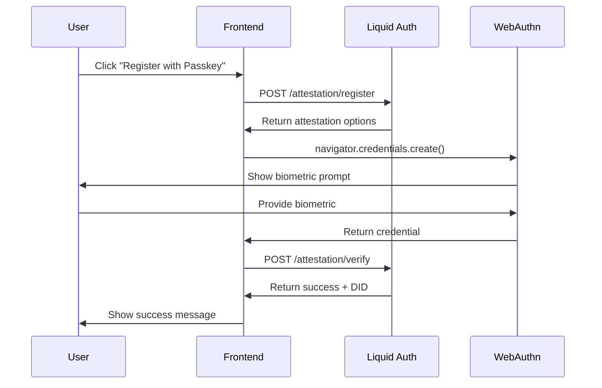
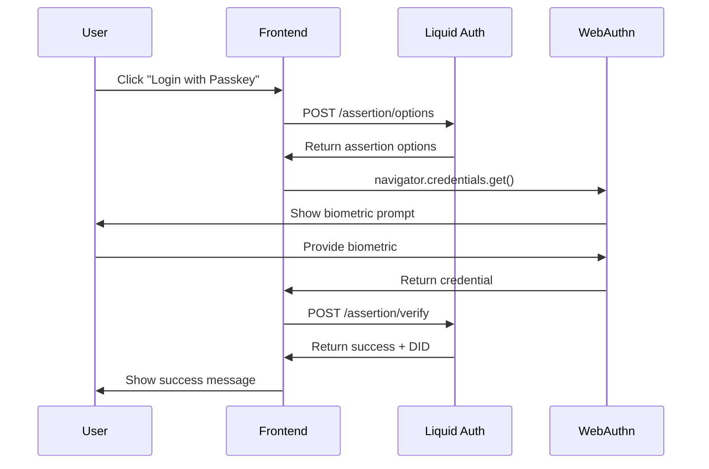
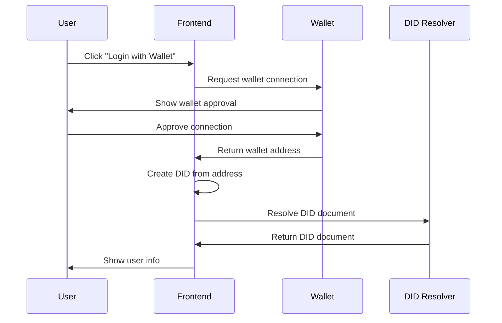

# Liquid Auth Integration Guide

This guide provides complete step-by-step instructions for integrating Algorand Foundation Liquid Auth into your Algorand dApp with Docker backend and React frontend.

## 🏗️ Architecture Overview

```
┌─────────────────┐    ┌─────────────────┐    ┌─────────────────┐
│   React Frontend │    │  Liquid Auth    │    │   MongoDB       │
│   (Port 5173)   │◄──►│   (Port 3000)   │◄──►│   (Port 27017)  │
└─────────────────┘    └─────────────────┘    └─────────────────┘
                                │
                                ▼
                       ┌─────────────────┐
                       │     Redis       │
                       │   (Port 6379)   │
                       └─────────────────┘
```

## 📋 Prerequisites

- Docker and Docker Compose
- Node.js 18+ and npm/yarn
- Git
- Modern browser with WebAuthn support
- Algorand wallet (Pera Wallet recommended)

## 🚀 Backend Setup (Docker)

### 1. Environment Configuration

Copy the environment file:

```bash
cp env.example .env
```

The `.env` file contains all necessary environment variables for Liquid Auth.

### 2. Start the Backend Services

```bash
# Start all services
docker-compose up --build

# Or run in detached mode
docker-compose up -d --build
```

This will start:

- **MongoDB** on port 27017
- **Redis** on port 6379
- **Liquid Auth** on port 3000

### 3. Verify Backend is Running

```bash
# Check if API is accessible
curl http://localhost:3000/health

# Check MongoDB connection
docker exec -it mongo mongosh -u algorand -p algorand --authenticationDatabase admin

# Check Redis connection
docker exec -it redis redis-cli ping
```

## 🎨 Frontend Setup

### 1. Install Dependencies

```bash
cd projects/algorand-frontend
npm install socket.io-client
```

### 2. Update Vite Configuration

The `vite.config.ts` has been updated with proxy configuration to forward requests to the Liquid Auth server:

```typescript
server: {
  proxy: {
    '/auth': 'http://localhost:3000',
    '/attestation': 'http://localhost:3000',
    '/assertion': 'http://localhost:3000',
    '/socket.io': 'http://localhost:3000',
  },
}
```

### 3. Add Liquid Auth Component

The `LiquidAuth.tsx` component has been created with:

- Passkey registration and login
- Algorand wallet integration
- DID resolution
- Real-time socket connection

### 4. Integrate into Your App

Add the component to your main app:

```tsx
import LiquidAuth from "./components/LiquidAuth";

function App() {
  const handleLogin = (user) => {
    console.log("User logged in:", user);
    // Store user data, redirect, etc.
  };

  const handleLogout = () => {
    console.log("User logged out");
    // Clear user data, redirect, etc.
  };

  return (
    <div>
      <LiquidAuth onLogin={handleLogin} onLogout={handleLogout} />
    </div>
  );
}
```

## 🔧 API Endpoints

### Liquid Auth Server Endpoints

| Endpoint                | Method | Description                    |
| ----------------------- | ------ | ------------------------------ |
| `/attestation/register` | POST   | Register new user with Passkey |
| `/attestation/verify`   | POST   | Verify Passkey registration    |
| `/assertion/options`    | POST   | Get login options              |
| `/assertion/verify`     | POST   | Verify Passkey login           |
| `/health`               | GET    | Health check                   |

### Socket.IO Events

| Event                 | Description              |
| --------------------- | ------------------------ |
| `connect`             | Connected to server      |
| `disconnect`          | Disconnected from server |
| `attestation_success` | Registration successful  |
| `attestation_error`   | Registration failed      |
| `assertion_success`   | Login successful         |
| `assertion_error`     | Login failed             |

## 🔐 Authentication Flows

### 1. Passkey Registration Flow



### 2. Passkey Login Flow



### 3. Algorand Wallet Login Flow



## 🧪 Testing

### 1. Test Backend Services

```bash
# Test Liquid Auth API
curl -X GET http://localhost:3000/health

# Test MongoDB
docker exec -it mongo mongosh -u algorand -p algorand --authenticationDatabase admin
> use liquid-auth
> db.users.find()

# Test Redis
docker exec -it redis redis-cli ping
```

### 2. Test Frontend Integration

1. Start the frontend:

```bash
cd projects/algorand-frontend
npm run dev
```

2. Open http://localhost:5173

3. Test the following flows:
   - **Passkey Registration**: Click "Register with Passkey"
   - **Passkey Login**: Click "Login with Passkey"
   - **Wallet Login**: Click "Login with Algorand Wallet"

### 3. Test DID Resolution

```bash
# Test DID resolution
curl "https://resolver.goplausible.xyz/resolve?did=did:algo:testnet:YOUR_ADDRESS"
```

## 🐛 Troubleshooting

### Common Issues

1. **Docker build fails**

   ```bash
   # Clean Docker cache
   docker system prune -a
   docker-compose up --build
   ```

2. **MongoDB connection fails**

   ```bash
   # Check MongoDB logs
   docker logs mongo

   # Restart MongoDB
   docker-compose restart mongo
   ```

3. **WebAuthn not working**

   - Ensure you're using HTTPS in production
   - Check browser console for errors
   - Verify WebAuthn support: `navigator.credentials` should exist

4. **Socket connection fails**

   ```bash
   # Check Liquid Auth logs
   docker logs liquid-auth

   # Verify proxy configuration in vite.config.ts
   ```

### Debug Commands

```bash
# View all container logs
docker-compose logs

# View specific service logs
docker-compose logs liquid-auth
docker-compose logs mongo
docker-compose logs redis

# Check container status
docker-compose ps

# Restart specific service
docker-compose restart liquid-auth
```

## 🚀 Production Deployment

### 1. Environment Variables

Update `.env` for production:

```env
NODE_ENV=production
ALGORAND_NETWORK=mainnet
ALGORAND_NODE_URL=https://mainnet-api.algonode.cloud
ALGORAND_INDEXER_URL=https://mainnet-idx.algonode.cloud
ORIGIN=https://yourdomain.com
HOSTNAME=yourdomain.com
```

### 2. Security Considerations

- Use HTTPS in production
- Set up proper CORS policies
- Use environment variables for secrets
- Enable MongoDB authentication
- Set up Redis password protection

### 3. Scaling

- Use external MongoDB and Redis services
- Set up load balancing for Liquid Auth
- Use CDN for frontend assets
- Monitor with logging and metrics

## 📚 Additional Resources

- [Liquid Auth GitHub](https://github.com/algorandfoundation/liquid-auth)
- [WebAuthn Specification](https://www.w3.org/TR/webauthn-2/)
- [Algorand DID Method](https://github.com/algorandfoundation/ARCs/blob/main/ARCs/arc-0005.md)
- [Docker Compose Documentation](https://docs.docker.com/compose/)

## 🤝 Support

If you encounter issues:

1. Check the troubleshooting section above
2. Review Docker and application logs
3. Verify all environment variables are set correctly
4. Ensure all services are running and accessible

---

**Happy coding! 🚀**
